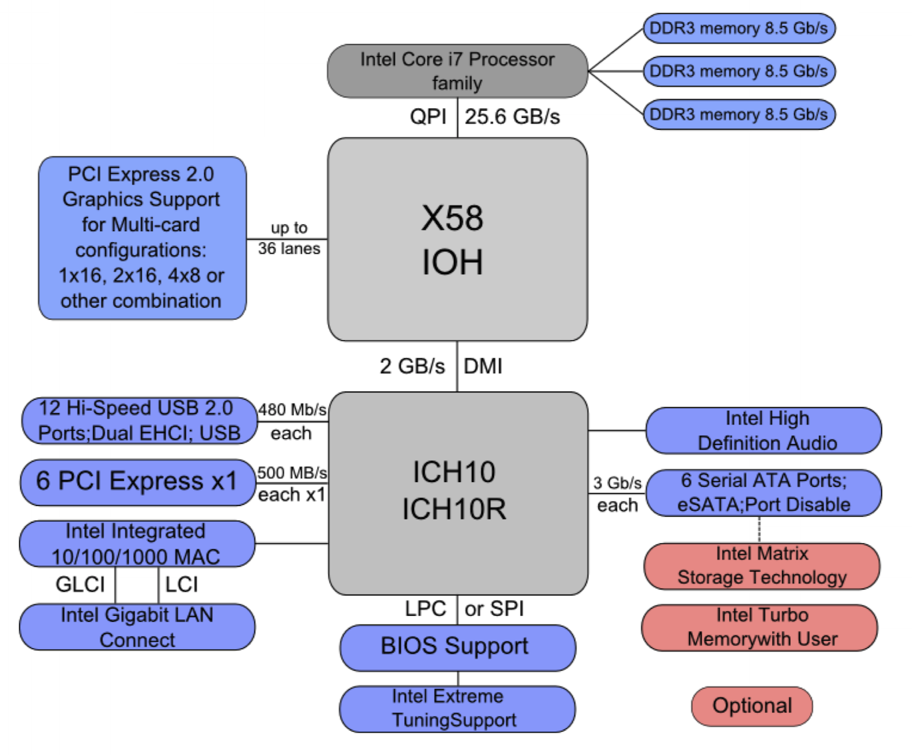

# Device Management

## Example: Intel Architecture



Typically with Intel architecture, there are two parts:

- **Northbridge**: connects to faster I/O devices through a PCI express bus, which can have various I/O devices connected to it (e.g. graphics cards). This is the top grey square connected to the processor.
- **Southbridge**: connects to slower I/O devices (e.g. USB) and a potentially slower PCI express lanes (e.g. to sound cards).

The slower I/O devices are further away from the CPU as they require less bandwidth when communicating with the CPU.

## Objectives of Device Management

- Fair access between difference user processes to shared devices.
- Exploit parallelism of I/O devices for multithreaded programming. For example, multiple processes may be sending requests to an I/O device (e.g. a disk).
- Provide a uniform view of I/O operations by hiding the complexity of handling devices and giving uniform namoing and error handling.

## Device Independence

**Device independence** means the OS should want to abstract away from the specific device type (e.g. a termianl, disk, or DVD drive), and the particular device instance (e.g. which disk).

There are various variations of properties that devices can have:

- Unit of data transfer: **character** or **block**.
- Supported operations (e.g. **read**, **write**, **seek**).
- **Synchronous** or **asychronous** operation.
- Speed differences.
- Sharability:
  - Sharable (e.g. disks).
  - Single user (e.g. printers, DVD-RW).
- Type of error conditions.

### Character vs. Block


```

  *--------------------------*
  |      File Subsystem      |
  *--------------------------*
       |             |
       |             V
       |      *--------------*
       |      | Buffer Cache |
       |      *--------------*
       |             |
       V             V
  *-----------*--------------*
  | Character |    Block     |
  *-----------*--------------*
  |      Device Drivers      |
  *--------------------------*

```

