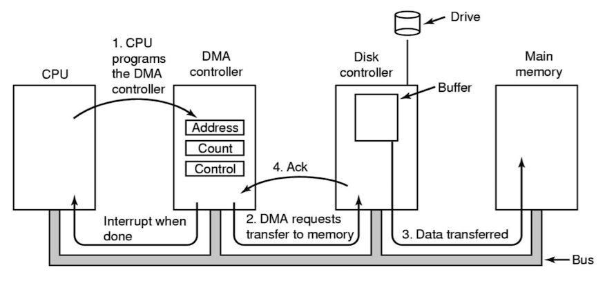

# Device Drivers

## Memory Mapped I/O

When implementing a device driver, there needs to be a way of interacting directly with the hardware. This is often done using **memory mapped I/O**.

**Memory mapped I/O** means particular device registers live in the memory address space.

For example, to disable the I2S clock on a Raspberry Pi:

```c
*(clk + 0x26) = 0x5A000000;
*(clk + 0x27) = 0x5A000000;
```

This works by the MMU recognising particular addresses and understanding that these addresses actually refers to a device connected to the CPU via the PCI express bus.

## I/O Methods

1. **Programmed I/O**: directly writing to registers to control the device (naive). This is very inefficient as I/O devices are much slower than the CPU, meaning many CPU cycles will spent before the I/O operation completes.
2. **Interrupt-Driven I/O**: the CPU gets interrupted by the I/O device to indicated to the device driver that it can interact with the device again. This may result in a large number of interrupts.
3. **Direct Memory Access (DMA)**: the CPU hands more controller over to the DMA controller, relieving the CPU from handling a large number of interrupts.



## Linux: Loadable Kernel Module (LKM)

**Loadable kernel modules** provide device drivers. They:

- contain object code that is loaded **on-demand**:
  - they are dynamically linked to the running kernel.
  - they provided by hardware vendor or independent developers.
- require **binary compatibility**. Modules written for different kernel versions may not work.

**Kmod** is the kernel subsystem for managing modules without user intervation. It determines module dependencies, and loads modules on demand.

Every LKM module consists of two basic functions (at a minimum):

```c
// used for all initialisation code
int init_module(void) {
  // ...
}

// used for clean shutdown
void cleanup_module(void) {
  // ...
}
```

Modules are then loaded by issuing the follow command: `insmod module.o`. This is normally restricted to root only.
