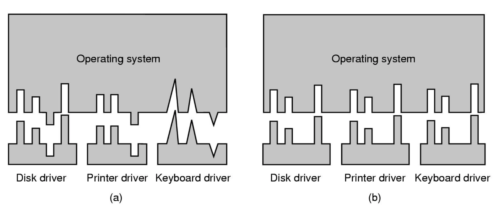

# Device Independent OS Software

The device independent layer is about providing a uniform interface for all device drivers:

In this diagram, (b) has a standard driver interface whereas (a) does not.

Having a standard driver interface can make it easier to implement device drivers, which is important as device drivers are often written by a third party (e.g. manufacturers).

The device independent layer provides **device independence**. This means:

- introducing a mapping from logical to physical devices (naming and switching). For example, disk may have a physical way of referring to them but often they're exposed in terms of partitions and volumes.
- validation of requests against device characteristics (e.g. it doesn't make sense to write a character to an input device such as a mouse).
- dealing with the allocation of **dedicated** devices as there will need to be mutual exclusion for a single process using that device.
- dealing with protection / user access validation (e.g. some devices may only be accessed by the super user).
- buffering and caching of blocks for performance and block size independence (providing buffering and caching at this layer means it can be used across a wide range of block devices).
- handling error reporting.

## Dedicated vs. Shared Device Allocation

A **dedicated** device (e.g. DVD writer, terminal, printer, etc):

- has a simply policy (e.g. fails if opened twice, or queues open requests).
- is usually allocated for long peroids of time.
- is only allocated to authorised processes.

A **shared** device (e.g. disks, window terminals, etc):

- are used by many user processes concurrently.
- in the case of disks, the OS provides file systems as a means of sharing a disk among different processes.

### Device Allocation: Spooling

Blocking a process' access to an allocated, nonshareable device can cause delays and bottlenecks. Instead, a queuing system known as **spooling** can be used. 

For an allocated spooled device, when a job is submitted to it instead the OS can save the job to disk. Then a single process called the **spooler daemon** is the only process alloweed to directly control the device. The daemon then picks up the safe jobs and submits them to the device, one after the other.

This technique provides sharing of nonsharable devices, and reduces I/O time which gives a greater throughput.

## Buffering

**Buffering** lives in the device independent layer, and its function is very important. Most block devices will support buffered I/O, meaning blocks of data can be stored in the buffer cache. For example, if there is a future request to a disk for data that was previously retrieved, instead of the device having to retrieve it again (which may be slow) it can be read directly from the buffer cache.

### Buffered vs. Unbuffered I/O

**Buffered I/O** can be used for both reads and writes. For example:

- when writing to the output buffer, the process can continue until the buffer is full. Data can then be flushed to the device asychronously.
- when reading, the OS may read ahead to pre-fetch additional blocks of data so when the process goes to read them, it can just access it in the fast buffer cache instead of having to wait for the device to fetch the data (spatial locality).

Buffered I/O can be used to smooth peaks in I/O traffic, and it can cater to differences in data transfer units between devices.

However, some applications may want **unbuffered I/O**. In this case, data is transferred directly from user space to / from the device (each read / write causes physical I/O, meaning the device handler is used for each transfer). This may cause high process switching overhead (e.g. per character).

Database systems may wish to use unbuffered I/O as they may have more information on what type of requests will be submitted in the future, meaning they can implement a more effective caching strategy than the hardware.

