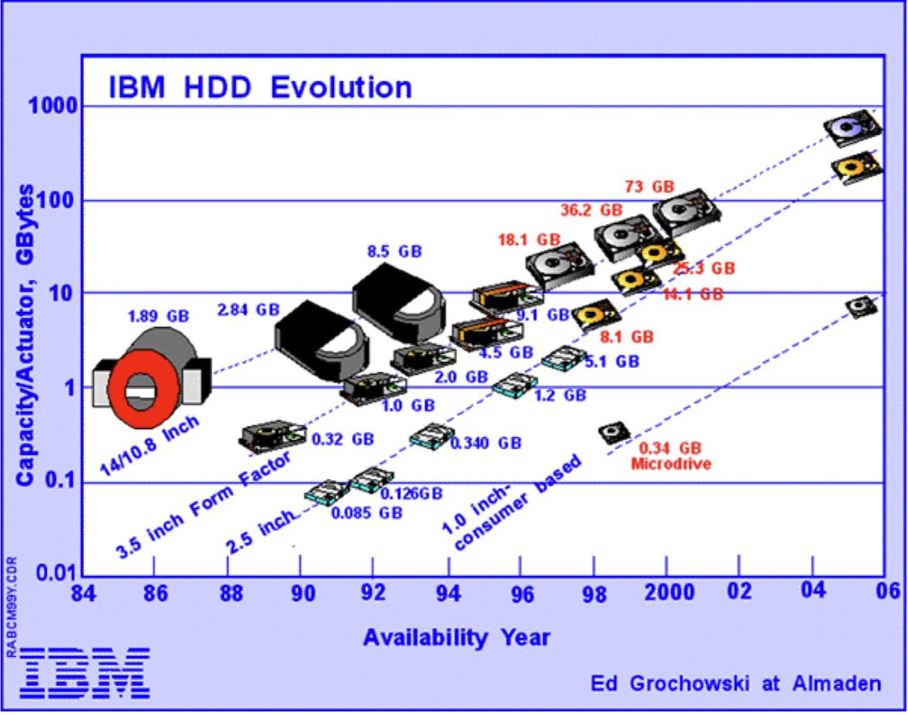
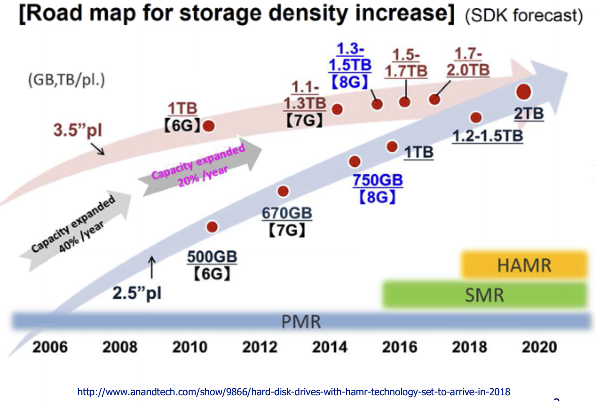
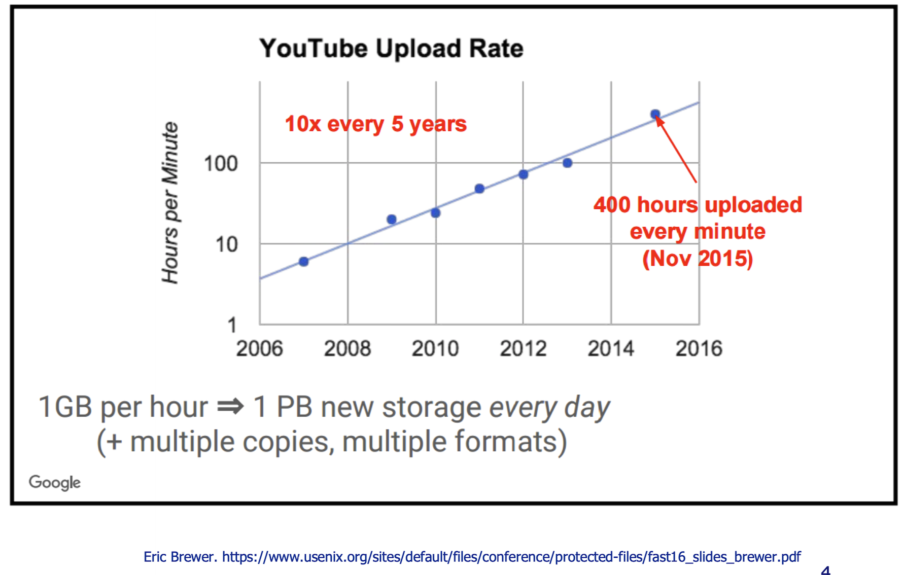
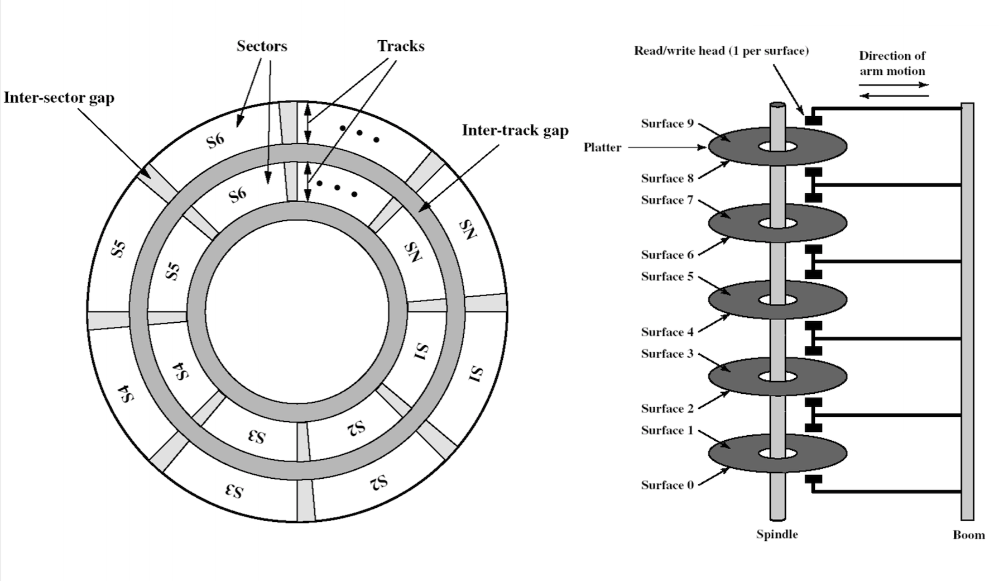
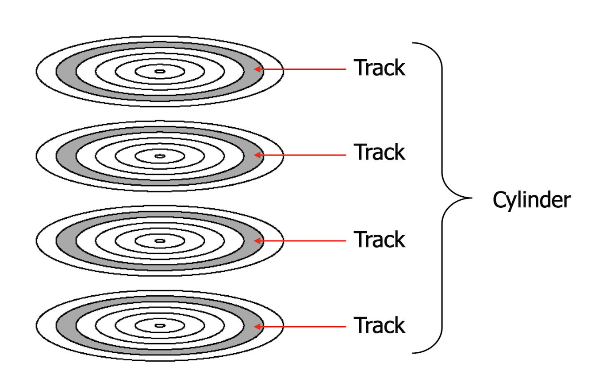
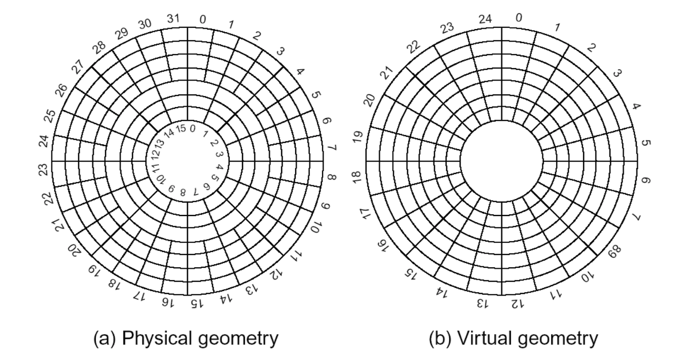
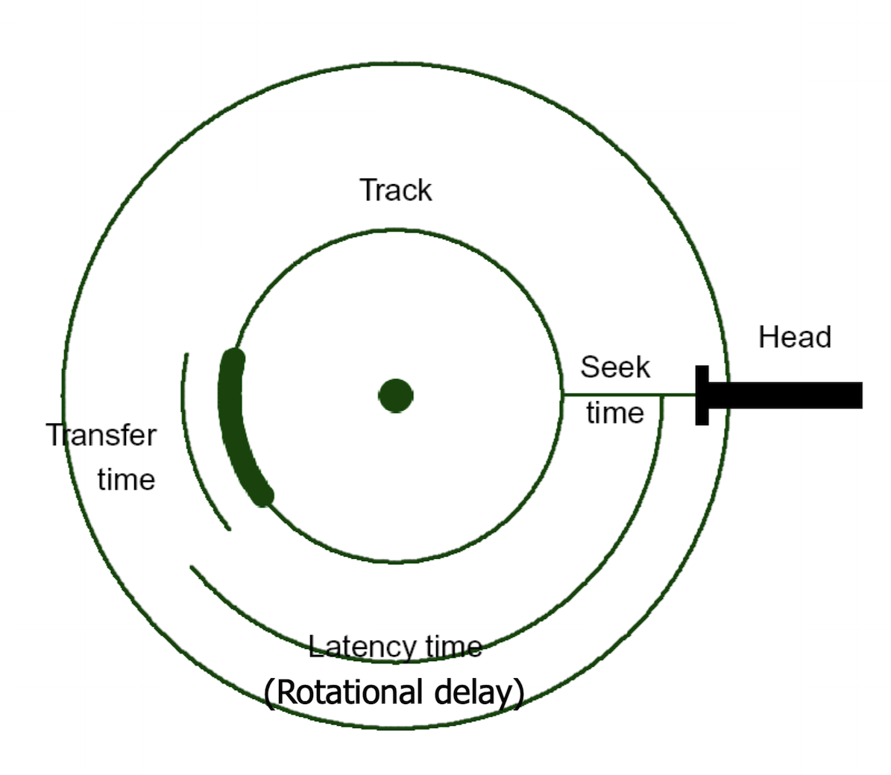

# Disk Management

## Disk Evolution





Over time disk capacity has increased exponentially, but access speeds haven't. This is due to magnetic disks having mechanical parts, meaning increasing the access speeds to disks is much more challenging as they are by both engineering and physcial limitations.

## What is driving demand?



Large volumes of data are being generated, and they require an ever increasing amount of storage. The diagram above is an example which shows that YouTube is generating data at an exponential rate, so only an exponential increase in storage capacity is able to meet these demands.

## Disk Storage Devices



This diagram shows the general organisation of a disk. Each platter is subdivided into tracks, and the tracks are further subdivided into sectors. These sectors on the disk are the actual areas that store the data. A disk may contain multiple platters, with each platter having two surfaces. Platters are stacked up on a spindle and a read / write head is able to move across all of the different surfaces that exist simulaneously.

### Tracks and Cylinders



All tracks that are on top of each other (e.g. the shaded tracks on the platters in the diagram above) can be read from simulaneously by the read / write head. This works by the platters spinning, and when the read write head is over a particular track it can read all of the information that is stored on that track. Since this happens to all of the tracks that are on top of each other, this multi-layered track is refered to as a cylinder (a cylinder is essentially the unit of information that can be read from or written to in a single operation).

### Sample Disk Specification

```

  *------------*-------------*-------------*
  | Parameter  | IBM 360KB   | Seagate     |
  |            | Floppy Disk | Barracuda   |
  |            |             | ST 400832AS |
  *------------*-------------*-------------*
  | No. of     | 40          | 16,383      |
  | cylinders  |             |             |
  *------------*-------------*-------------*
  | Tracks per | 2           | 16          |
  | cylinder   |             |             |
  *------------*-------------*-------------*
  | Sectors    | 9           | 63          |
  | per track  |             |             |
  *------------*-------------*-------------*
  | Bytes per  | 512         | 512         |
  | sector     |             |             |
  *------------*-------------*-------------*
  | Sectors    | 720         | 781,422,768 |
  | per disk   |             |             |
  *------------*-------------*-------------*
  | Disk       | 360KB       | 400GB       |
  | capacity   |             |             |
  *------------*-------------*-------------*

```

### Future of HDDs: HAMR

Heat Assisted Magnetic Recording (HAMR) is a technique that allows for information to be stored in a more compact part of the platter surface, increasing the potential capacity. By heating up the medium before storing the bit, it allows for a more precise write.

HAMR can reach a density of 1.5 Tb per squared inch.

### Sector Layout



Because of the concentric shape of the of the sectors, depending on where the sector is the capacity may vary. This is an issue as there would not be a uniform storage density across the platter's surface if the number of sectors per track is kept constant. To solve this, disks usually distinguish between a virtual geometry and a physcial geometry.

The virtual geometry looks like regular concentric sectors on a disk, with a fixed number of sectors per track. On the other hand, the physcial geometry may actually be diffent. In the example above, there are more sectors per track in the outer zones compared with the inner zones. This is to account for the different sizes in sectors due to their location on the disc.

The physcial geometry is hidden from the software by remapping the data in a way that it seems like it is laid out in the virtual layout.

Platter surfaces can be divided into 20 or more zones.

### Disk Addressing

It used to be the case that the geometry was actually exposed to the OS. The OS would then refer to a particular cylinder number, a suface, and then a sector. This would uniquely select 512 bytes of information (assuming this is the sector size).

Modern discs use **LBA** (logical block / sector addressing) instead. In LBA, sectors are numbered from 0 to n. Using this, any sector can be directly refered to by its sector number. This helps make disk management much easier, and it helps to work around BIOS limitations.

### Disk Formatting

Before a disk can be used, it has to be formatted. Formatting is the process of imposing some structure onto the disk. There are two levels of format:

- **Low level format**: ensures there is enough structure on a disc such that sectors can be read from reliably.
  - A low level format will impose a sector structure, where each sector:
    - starts with a preamble to indicate that it is a the start of a new sector.
    - has 512 bytes of data.
    - has an error correcting code at the end which is used to detect if the data has been corrupted due to any physical errors on the disk's surface.
  - cylinder skew and interleaving were also imposed by low level formatting in the past. These are for the physical geometry of the disk, given a desired logical geometry.
  - Usually done by the manufacturer.
- **High level format**: this is done when adding file systems or partitions to the disk. It includes:
  - the boot block.
  - free block list.
  - root directory.
  - the empty file system.

There is more information about high level formatting in the file systems chapter.

### Disk Delays



Hard disks are relatively slow I/O devices. This is due to them having moving mechanics inside them. The speed of these mechanics determines the time it takes to retrieve data from the disk.

There are a few contributors to the overall delay:

- **Seek time**: the time taken for the read / write head to physically move over the disk's surface.
- **Latency time**: the time taken for the disk to rotate such that the desired sectors are under the read / write head.
- **Transfer time**: the time taken for the disk to rotate through all of the desired sectors.

#### Disk Performance

A typical disk has:

- Sector size: 512 bytes.
- Seek time (between adjacent cylinders / tracks): < 1ms.
- Seek time (average): 8ms.
- Rotation time (Average latency): 4ms.
- Transer rate: upwards of 100MB per sec.

Given:

- `b`: the number of bytes to be transferred.
- `N`: the number of bytes per track.
- `r`: the rotation speed in revolutions per second.

let:

- Latency time (rotational delay): `1 / 2r`
- Transfer time: `b / rN`

Thus the total access time is given by `seek time + 1 / 2r + b / rN`

