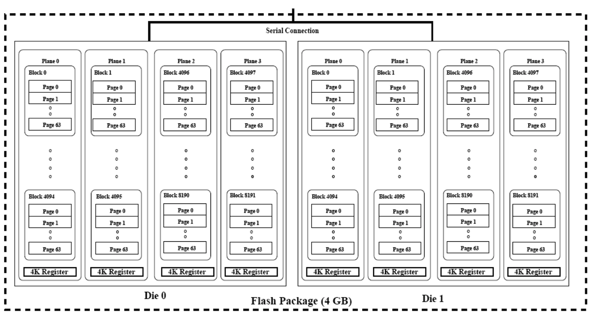
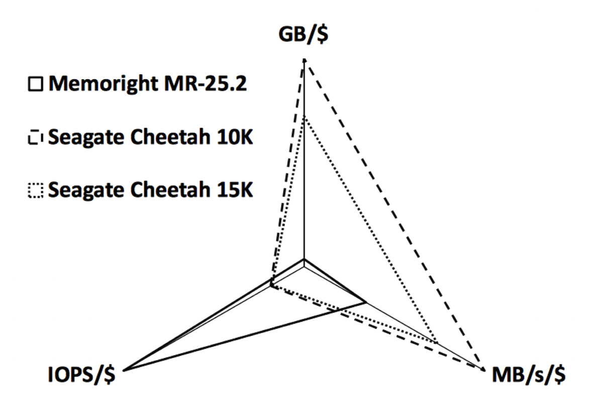

# Disk Scheduling

The OS will want to minimise the seek and latency times, as they are the main contributors (especially the seek time as it is approximately 2-3 times larger). Either the OS or disk controller will order the requests with respect to head's position. If every seek is to an adjacent cylinder, then the seek time is significantly reduced, improving the overall disk performance.
sk Scheduling

## Disk Scheduling Algorithms

### First Come First Served (FCFS)

Requests are unordered, causing random seek patterns. This is okay for lightly-loaded disks, but has poor performance for heavy loads. Scheduling is fair.

### Shortest Seek Time First (SSTF)

Requests are ordered according to the shortest seek distance from the current head position. This may discriminate against the innermost / outermosts tracks, and it has unpredictable and unfair performance.

### SCAN Scheduling

Requests are chosen which result in the shortest seek time in a preffered direction. The read / write head should only change direction when it reaches the outermost / innermost cylinder (or there are no further requests in the preffered direction). This can cause long delays for requests at extreme locations

This is the most common scheduling algorithm.

### C-SCAN

Requests are only served in one direction only. When the head reaches the innermost request, it jumps to the outermost request. This lowers the variance of requests on the extreme tracks, but it may delay requests indefinitely (although it is unlikely).

### N-Step SCAN

Similar to C-SCAN, but requests are only serviced if they were waiting when the sweep began. This has the benefit of it being impossible to delay requests indefinitely.

## Linux: Disk Scheduling

In the Linux kernel, I/O requests are placed in a **request list**. There is one request list per disk block device in the system. There is a `bio` structure which associates memory pages with requests for when data needs to be written to / read from a particular sector.

The block device driver for a disk must implement a function that can execute a request. The kernel can then pass an ordered request list (according to how it wants to schedule those requests) to the device driver. The driver must perform all operations in the list, but they can also perform their own ordering they understand the geometry / specifics of the device better (e.g. RAID). The driver cannot define its own read / write operations.

Linux by default uses a variation of the SCAN algorithm. The kernel attempts to merge requests into adjacent blocks so they can be done together. 

The kernel also wants to avoid the scenario where synchronous reads which may starve during large writes. For example, assume there are two processes competing for the disk, where one is issuing a read and then blocking until the data is available, and the other is trying to write a large buffer to disk. Once the data is available to the first process, it will then perform some computation on the data and then issue the next read request for the next adjacent block on disk. However, the other process will keep issuing write requests as it will always have data to be written out. This can cause the read requests to starve as there will be far more write requests being submitted. 

Linux solves this by using a **deadline scheduler**. This simply ensures that read requests will be performed by some deadline, even if it results in a longer seek time. This eliminats read request starvation.

Another technique used by the linux scheduler is **anticpatory scheduling**. This means that if a process issues one read request, there's a high likelyhood that it will submit another read request after a short period of time. Therefore, by introducing a slight delay after a read request completes it gives the process time to issue another read operation. This can help reduce excessive seeking behaviour, but it can also lead to reduced throughput if the process does not issue another read requests to a nearby location.

## Solid State Drives (SSDs)

SSDs are another widely used storage technology. They work very differently to HDDs as they aren't mechanical. They are simply non-volatile memory devices.

This diagram shows the internal organisation of an SSD disk in terms of a flash package (flash memory is used, and it is organised into multiple die). There are also blocks of memory which are split into pages, and a there is a particular connection into the package which is used to read / write data from / to the different parts of the flash package. This is what enables parallelism, as multiple parts of the SSD can be accessed in parallel (the number of concurrent read / write operations depends on the width of the bus).

## SSDs vs. HDDS

SSDs have more bandwidth (1GB/s read / write vs. 100MB/s) and smaller latencies (microseconds vs milliseconds). SSDs are also less prone to being damage from movement as they have no moving parts. However, SSDs are also typically more expensive.

