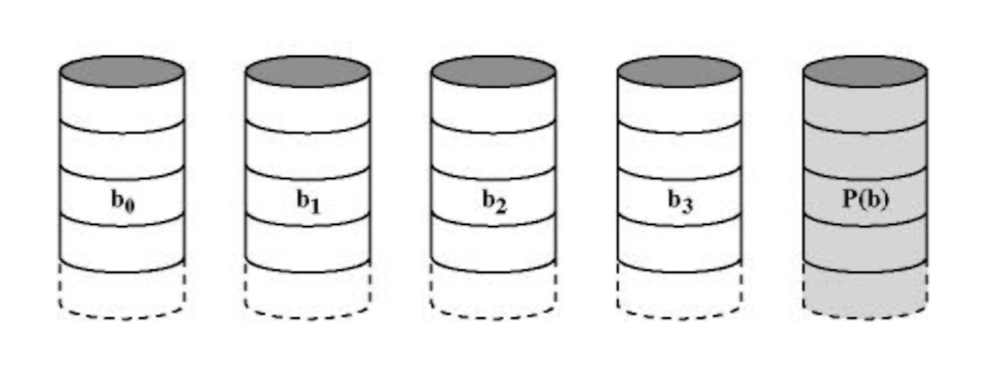

# RAID

CPU performance is doubling every 18 months, but disk performance has only doubled 10 times since 1970. To resolve this bottleneck, parallel disk I/O is used.

**RAID (Redundant Array of Inexpensive Disks)** is a storage virtualisation technology that uses an array of physcial disks to appear as a single virtual drive. It can be used to distribute data across the drive array, allow for parallel operation (known as **stripingi**). It can also be used to setup redundant disks to respond to disk failure. The more disks that are used in a system, the lower the mean-time-to-failure (**MTTF**) is.

## RAID Striping


A stripe is when data is spread across all drives in the array, allowing for concurrent I/O operations. The RAID controller (either dedicated hardware or software in the OS) hides this from the OS, showing a logical disk with sequential strips data in the disk instead.

## RAID Levels


There are different RAID levels with different properties, in terms of:

- performance characteristics.
- level of redundancy.
- degree of space efficiency (cost).

Some of these levels are no longer used in practice.

### RAID Level 0 (Striping)


In RAID 0, data is spread out across multiple disks, allowing for concurrent seeking / transferring of data. It also may balance the load across disks.

There is no redundancy in this setup, so if any drive is lost then all of the data in the array may be lost.

### RAID Level 1 (Mirroring)


In RAID 1, data is mirrored across multiple disks. This is to introduce a redundant backup of data, providing easy failure recovery. Reading from the disks is fast as each copy may be used to service the request, but writting is slower as the data needs to be written across all disks in parallel.

Storage overhead cost is high in RAID 1.

### RAID Level 2 (Bit-Level Hamming)


In RAID 2, parallel access is provided by striping individual bits across the drives. Hamming error-correcting-codes (ECC) are stored on additional drives in parallel to provide data recovery for single bit errors (and to detect double-bit errors). RAID 2 has a very high throughput for reads / writes, but all disks must participate in I/O requests in a **read-modify-write** cycle (meaning no concurrency).

RAID 2 is only used if a high error rate is expected, as the ECC disks become a bottle neck and there is a high storage overhead. RAID 2 isn't used much in practice anymore.

### RAID Level 3 (Byte-Level XOR)



RAID 3 is similar to RAID 2, but only a single disk is used for parity bits. The bits striped across all of the disks a XORed together to produce this parity bit:

```
parity = data1 XOR data2 XOR data3 ...
```

Using the remaining data and parity bit, data still be reconstructed. RAID 3 has a lower storage overhead compared to RAID 2, but again only one I/O request can take place at any given time.

### RAID Level 4 (Block-Level XOR)


In RAID 4, drives are striped in blocks, and a parity strip exists on an additional drive. The parity strip is handled on a block basis, and each disk can operate independently. This allows for the service of concurrent reads, but the parity disk tends to become a bottleneck on writes as both the data and and parity strips must be updated.

### RAID Level 5 (Block-Level Distributed XOR)


RAID 5 is similar to RAID 4, but parity strips are distributed across all the drives in a round robin fashion. This means that there is no longer a single parity disk that becomes the bottleneck. The is potential for concurrent writing, and there is a good storage efficiency / redundancy trade-off. However, data reconstruction of a failed disk is non-trivial and is slow.

## RAID Summary

```

  *-------------*-------*--------------------------------------*-------------------*------------------*
  | Category    | Level | Description                          | I/O Data Transfer | I/O Request Rate |
  |             |       |                                      | (read / write)    | (reads / writes) |
  *-------------*-------*--------------------------------------*-------------------*------------------*
  | Striping    | 0     | Non-redundant                        | + / +             | + / +            |
  *-------------*-------*--------------------------------------*-------------------*------------------*
  | Mirroring   | 1     | Mirrored                             | + / 0             | + / 0            |
  *-------------*-------*--------------------------------------*-------------------*------------------*
  | Parallel    | 2     | Redundant via Hamming code           | ++ / ++           | 0 / 0            |
  | access      *-------*--------------------------------------*-------------------*------------------*
  |             | 3     | Bit interleaved parity               | ++ / ++           | 0 / 0            |
  *-------------*-------*--------------------------------------*-------------------*------------------*
  | Independent | 4     | Block interleaved parity             | + / -             | + / -            |
  | access      *-------*--------------------------------------*-------------------*------------------*
  |             | 5     | Block interleaved distributed parity | + / -             | + / - or 0       |
  *-------------*-------*--------------------------------------*-------------------*------------------*

          + = better than a single disk
          0 = same as a single disk
          - = worse than a single disk

```

