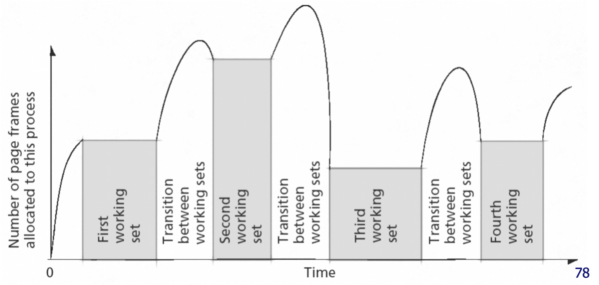
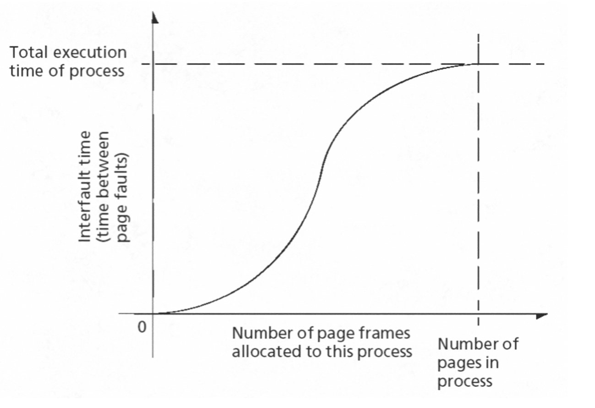

# Page Replacement

When there are no more free frames, a decision needs to be made on which frame needs to be replaced. This strategy for page replacement should:

- minimise the number of page faults as the swapping overhead is expensive (e.g. by avoiding having to bring the same page into memory several times).
- prevent over-allocation of memory (e.g. avoiding running out of memory by including page replacement in the page-fault service routine).
- use the modify (dirty) bit to reduce the overhead of page transfers (e.g. unmodified pages can simply be deleted from memory, whereas modified ones need to be written to disk).

## Basic Page Replacement

1. Find location of desired page on disk.
2. If there is a free frame then use it and stop, otherwise use replacement algorithm to select a **victim** frame.
3. Read the desired page into the newly freed frame.
4. Update the page and frame tables.
5. Restart the process.

## Page Replacement Algorithms

In general, a page replacement algorithm wants to achieve the lowest possible page-fault rate.

Different replacement algorithms can be compared using a **reference string**. A **reference string** is a string of memory references, such as `1,2,3,4,1,2,5,1,2,3,4,5`, where each number is a page number. By applying this string under a different replacement algorithms, each algorithm can be compared by counting the number of page faults that occur for a particular reference string.

### First-In-First-Out (FIFO)

This algorithm simply replaces the oldest page. This can be bad as the oldest page may be a heavily used page.

#### Bealdy's Anomaly

**Bealdy's Anomaly** is in certain algorithms the number of page faults can increase when the number of frames increases. However as the number of frames continues to grow, the number of page faults will continue to go down.

This can be shown using the replacement string `1,2,3,4,1,2,5,1,2,3,4,5` with FIFO:

```
                                   3 Frames

  Reference String:    1   2   3   4   1   2   5   1   2   3   4   5
                     *---*---*---*---*---*---*---*---*---*---*---*---*
                     |(1)| 1 | 1 |(4)| 4 | 4 |(5)| 5 | 5 | 5 | 5 | 5 |
                     *---*---*---*---*---*---*---*---*---*---*---*---*
            Frames:  |   |(2)| 2 | 2 |(1)| 1 | 1 | 1 | 1 |(3)| 3 | 3 |
                     *---*---*---*---*---*---*---*---*---*---*---*---*
                     |   |   |(3)| 3 | 3 |(2)| 2 | 2 | 2 | 2 |(4)| 4 |
                     *---*---*---*---*---*---*---*---*---*---*---*---*
        Page Fault:    Y   Y   Y   Y   Y   Y   Y           Y   Y


                                   4 Frames

  Reference String:    1   2   3   4   1   2   5   1   2   3   4   5
                     *---*---*---*---*---*---*---*---*---*---*---*---*
                     |(1)| 1 | 1 | 1 | 1 | 1 |(5)| 5 | 5 | 5 |(4)| 4 |
                     *---*---*---*---*---*---*---*---*---*---*---*---*
                     |   |(2)| 2 | 2 | 2 | 2 | 2 |(1)| 1 | 1 | 1 |(5)|
            Frames:  *---*---*---*---*---*---*---*---*---*---*---*---*
                     |   |   |(3)| 3 | 3 | 3 | 3 | 3 |(2)| 2 | 2 | 2 |
                     *---*---*---*---*---*---*---*---*---*---*---*---*
                     |   |   |   |(4)| 4 | 4 | 4 | 4 | 4 |(3)| 3 | 3 |
                     *---*---*---*---*---*---*---*---*---*---*---*---*
        Page Fault:    Y   Y   Y   Y           Y   Y   Y   Y   Y   Y


```

As is shown, with 3 frames there were 9 page faults, but with 4 frames there were 10 page faults.

### Optimal Algorithm

The best possible algorithm is to replace the page that won't be used for the longest period of time. This is impossible in practice, but it can be used for measuring how well an algorithm performs.

For example, the optimal algorithm with 4 frames applied to the reference string `1,2,3,4,1,2,5,1,2,3,4,5` will cause 6 page faults.

### Least Recently Used (LRU) Algorithm

By assigning a counter (e.g. a timestamp of when it was last used) to each page, whenever a page is referenced the current clock time can be copied into the page's counter. When it is time to replace a page, the oldest counter is selected.

For example, the LRU with 4 frames applied to the reference string `1,2,3,4,1,2,5,1,2,3,4,5` will cause 8 page faults.

Proper LRU is expensive as it uses exact timestamps. This cost can be reduced by approximating the timestamps instead using a **reference bit**.

#### Reference Bit

Each page is associated with a reference bit, initially set to `0`. When a page is referenced, its reference bit is set to `1` (which can be done automatically in hardware). During replacement, a page with an unset reference bit is picked. To prevent all of pages having set reference bits, the OS should reset them periodically.

Reference bits don't provide an ordering of pages unlike proper LRU, however it does let the OS distinguish between pages that have or haven't been recently referenced.

#### Second Chance

Improving on reference bits, the **second chance** algorithm adds an additional factor by putting all pages into a circular list (queue) and ordering them by when they were brought into memory. By maintaining a pointer to the next "victim" page, the OS can decide whether it will either evict the current victim, or move onto the next one. It decides this using the reference bit. If the bit is set, then the algorithm unsets it and moves onto the next page, otherwise the current page is evicted. This allows for pages to be given a second chance instead of having to wait for a period unset of reference bits.

**TODO DRAW DIAGRAM**

This algorithm is fairly common due to its easy implementation in hardware as the kernel only needs to store the circular list (the hardware can set / unset the reference bits). It also considers the order that pages were brought into memory.

### Counting Algorithms

A counting simply keeps a count of the number of references made to each page. There are two variants:

- **Least Frequently Used (LFU)**: replaces the page with the smallest count. This could be a page just brought into memory. This algorithm may suffer if a page previously had heavy usage but isn't used at all later. To solve this, the counters could be reset, or some form of **aging** could be used (more on this later).
- **Most Frequently Used (MFU)**: replace page with the largest count, especially if it hasn't been used for a while. This assumes that the page with the smallest count was probably just brought into memory, and hasnt had time to be used yet.

### Locality of Reference

For a program to run efficiently, the OS should maintain a programs *favoured* subset of pages in main memory. If it does not, it could lead to thrashing (excessive paging activity causing low prossor utilisation).

**Locality of reference** means that programs tend to request the same pages in space and time. In simpler terms, this means that if a program references a specific page:

- it is more likely to reference an adjacent page near it in the storage media then it is another page else where (spacial locality).
- it is more likely to keep accessing these pages over time then it is a new one (temporal locality).

### Working Set Model

A page replacement algorithm will want to exploit this observation of locality of reference. To do so, an algorithm can use the **working set model** of pages.

The **working set model** is defined as the pages that a process accesses repeatedly during a given time window. By defining some time window `w`, an algorithm can simply look at the pages that the process accessed in that window:


```

              W(t, w) = {2,6,7,8,9}

        t - w                         t
          V                           V
  *---*---*---*---*---*---*---*---*---*---*
  | 0 | 1 | 2 | 6 | 7 | 8 | 9 | 7 | 8 | 2 | --> Process execution time
  *---*---*---*---*---*---*---*---*---*---*
          |                           |
          |<------------w------------>|

           The pages referenced by the
           process during this time
           interval constitute its
           working set W(t, w)


```

This exploits the temporal locality of page references.

### Working Set Clock Algorithm

By adding a "time last used" value to the clock replacement algorithm, the working set for a given time window can be calculated.

Given some working set age window `w`, at each page fault examine the page pointed to in the clock queue:

- if the victim page's reference bit `R` is `0`, then set `R = 0` and continue to the next page.
- if `R` is already `0` then calculate the `age`:
  - if `age <= w`, then continue to the next page (e.g. this page is in the working set).
  - if `age > w`, then check if the page has been updated (dirty):
    - if the page is clean, replace it
    - if the page is dirty, then write it to the disk, unset the dirty bit, and continue to the next page.

#### Working Set Size

The algorithm now needs a method of deciding on a working set size `w`. The size of a working set can change during the execution of a process, but it will have transitional periods between each working set:



This diagram shows that the OS should only temporarily maintain pages outside of the working set in memory. It also highlights that one of the goals of an OS is to reduce any misallocation. In this context, misallocation would be either making the working set too large, holding onto pages that aren't being used, or making the working set too small causing frequently used pages to be swapped in and out of memory.

A solution to this is to observe the page fault frequency. If there are many page faults, then it's likely that the working set it larger than the OS has allocated, so more frames should be allocated to the process.



In this graph, the it shows that there is a point on the knee of the curve that the OS should want to aim for in terms of memory allocation, as it is a good balance between amount of allocated frames and time between page faults.

### Local vs. Global Page Replacement

- **Local Strategy**: Each process is given a fixed number of allocated frames, and by observing the fault frequency, changes in the working set size can be made.

- **Global Strategy**: Memory is shared dynamically between runnable processes. Initially, memory is allocated proportionally to the process size, and by considering the page fault frequency the allocation to each process can be tuned (e.g. more page faults per second = increase allocation).

There isn't a universally agreed solution. Linux uses global page replacement, whereas Windows uses local page replacement. The chosen strategy depends on the scheduling strategy.

## Linux Page Replacement

Linux uses a variation of a clock algorithm to approximating the LRU page replacement strategy. The memory manager uses two linked lists (and has reference bits on all pages):

- **Active list** contains all active pages, with the most recently used pages near the head (front).
- **Inactive list** contains all inactive pages, with the least recently used pages near the tail (rear).

Only pages in the inactive list are replaced.

**kswapd** (or swap daemon) reclaims pages in the inactive list when memory is low in the background. It uses a dedicated swap partition or file, and it must handle locked and shared pages.

**pdflush** is a kernel thread that periodically flushes dirty pages to disk. This happens synchronously in the background as it is an expensive process.
